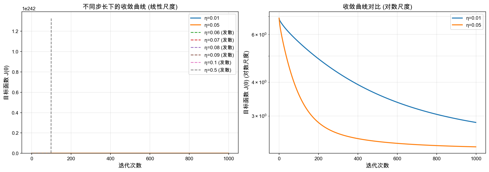
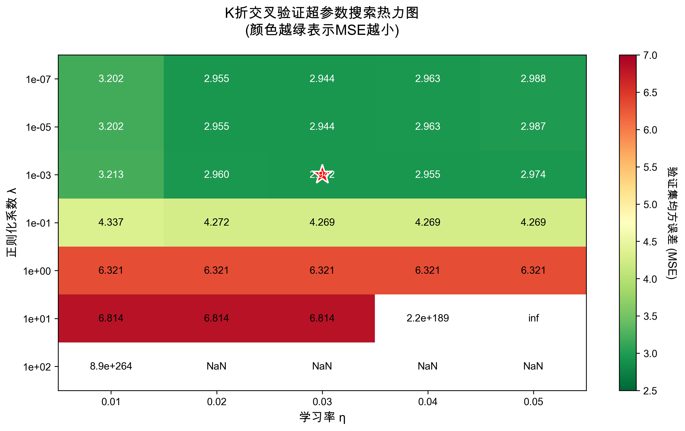
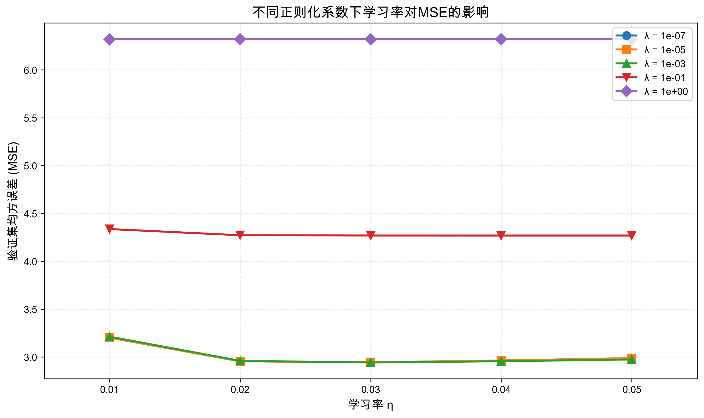

# 作业1:线性模型和支持向量机

**姓名**: 杨憬晗  
**学号**: 2022010808

---

## 线性模型与梯度下降

### 2.1 特征归一化

在实际任务中，若各维特征的量级差异较大，梯度下降的收敛会显著变慢；同时，在使用正则化时，量级较大的特征对正则项影响更强。因此需要进行特征归一化。常用做法是在训练集上对每个特征进行仿射变换，将其映射到区间[0,1]；并对测试集施加与训练集一致的变换。

#### 2.1.1 补全函数split_data，将数据集划分为训练集与测试集

**实现思路**：
- 根据`split_size`中的比例，依次计算每个划分的样本数量
- 使用索引切片将数据集划分为多个部分
- 处理最后一个划分以确保包含所有剩余样本

**代码实现**：
```python
start_idx = 0
for ratio in split_size:
    # 计算当前划分的样本数量
    split_num = int(num_instances * ratio)
    end_idx = start_idx + split_num
    
    # 处理最后一个划分，确保包含所有剩余样本
    if end_idx > num_instances or ratio == split_size[-1]:
        end_idx = num_instances
    
    # 划分数据
    X_list.append(X[start_idx:end_idx])
    y_list.append(y[start_idx:end_idx])
    
    start_idx = end_idx

return X_list, y_list
```

**关键点**：
- 使用累积索引方式进行数据划分
- 最后一个划分需要包含所有剩余样本，避免因浮点数计算导致的样本丢失

#### 2.1.2 补全函数feature_normalization，实现特征归一化

**实现思路**：
- 在训练集上计算每个特征的最小值和最大值
- 使用Min-Max归一化公式: \( x_{norm} = \frac{x - x_{min}}{x_{max} - x_{min}} \)
- 对测试集使用训练集的最小值和最大值进行相同的变换

**代码实现**：
```python
# 从训练集计算每个特征的最小值和最大值
train_min = np.min(train, axis=0)
train_max = np.max(train, axis=0)

# 避免除零错误：如果最大值等于最小值，说明该特征为常数
# 此时将范围设为1，保持归一化后的值不变
range_vals = train_max - train_min
range_vals[range_vals == 0] = 1  # 避免除零

# 将训练集归一化到 [0, 1]
train_normalized = (train - train_min) / range_vals

# 对测试集使用训练集的最小值和最大值进行相同的变换
test_normalized = (test - train_min) / range_vals

return train_normalized, test_normalized
```

**关键点**：
1. **统计量的计算**：所有归一化参数（最小值、最大值）都从训练集计算得出
2. **测试集一致性**：测试集必须使用训练集的统计量进行变换，确保分布一致
3. **边界情况处理**：当某个特征的最大值等于最小值时（常数特征），设置范围为1以避免除零错误
4. **向量化操作**：使用numpy的广播机制，对所有特征同时进行归一化，提高效率

**理论依据**：
- Min-Max归一化将特征线性映射到[0,1]区间
- 通过仿射变换 \( x' = \frac{x - min}{max - min} \) 实现
- 保证所有特征处于相同量级，有利于梯度下降的收敛
- 在正则化时，避免量级大的特征主导正则项

---

### 2.2 目标函数与梯度

岭回归(Ridge Regression)是在线性回归的基础上加入L2正则化，目的是防止过拟合并提高模型的泛化能力。

#### 2.2.1 写出\( J(\theta) \)的矩阵形式表达式

**已知条件**：
- 设计矩阵：\( X \in \mathbb{R}^{m \times (d+1)} \)，其中第 \( i \) 行为 \( x_i^\top \)
- 标签向量：\( y \in \mathbb{R}^m \)
- 参数向量：\( \theta \in \mathbb{R}^{d+1} \)
- 正则化系数：\( \lambda > 0 \)

**目标函数**：

岭回归的目标函数为：
\[
J(\theta) = \frac{1}{m} \| X\theta - y \|^2 + \lambda \| \theta \|^2
\]

展开为矩阵形式：
\[
J(\theta) = \frac{1}{m}(X\theta - y)^\top (X\theta - y) + \lambda \theta^\top \theta
\]

其中：
- 第一项 \( \frac{1}{m}(X\theta - y)^\top (X\theta - y) \) 是均方误差损失
- 第二项 \( \lambda \theta^\top \theta \) 是L2正则化项

#### 2.2.2 补全函数compute_regularized_square_loss，计算\( J(\theta) \)

**实现目标**：根据 \( J(\theta) = \frac{1}{m}(X\theta - y)^\top (X\theta - y) + \lambda \theta^\top \theta \) 实现目标函数。

**代码实现**：
```python
num_instances = X.shape[0]

# 计算预测值
predictions = np.dot(X, theta)

# 计算残差
residuals = predictions - y

# 计算平方损失: (1/m) * ||Xθ - y||²
square_loss = np.dot(residuals, residuals) / num_instances

# 计算正则化项: λ * ||θ||²
regularization = lambda_reg * np.dot(theta, theta)

# 目标函数 J(θ)
loss = square_loss + regularization

return loss
```

**关键点**：
- 使用 `np.dot` 进行向量化计算

#### 2.2.3 推导\( J(\theta) \)的梯度

**推导过程**：

对 \( J(\theta) = \frac{1}{m}(X\theta - y)^\top(X\theta - y) + \lambda \theta^\top\theta \) 求梯度。

分别对两项求导：

1. **对均方误差项求导**：
   \[
   \frac{\partial}{\partial\theta}\left[\frac{1}{m}(X\theta - y)^\top(X\theta - y)\right] = \frac{2}{m}X^\top(X\theta - y)
   \]

2. **对正则化项求导**：
   \[
   \frac{\partial}{\partial\theta}\left[\lambda\theta^\top\theta\right] = 2\lambda\theta
   \]

**梯度表达式**：
\[
\nabla J(\theta) = \frac{2}{m}X^\top(X\theta - y) + 2\lambda\theta
\]

**梯度含义**：
- \( \frac{2}{m}X^\top(X\theta - y) \)：均方误差项的梯度，将残差投影到特征空间
- \( 2\lambda\theta \)：正则化项的梯度，使参数向零收缩，防止过拟合
- 梯度下降更新：\( \theta_{t+1} = \theta_t - \alpha \nabla J(\theta_t) \)

#### 2.2.4 补全函数compute_regularized_square_loss_gradient，实现\( J(\theta) \)的梯度

**实现目标**： \( \nabla J(\theta) = \frac{2}{m}X^\top(X\theta - y) + 2\lambda\theta \)

**代码实现**：
```python
num_instances = X.shape[0]

# 计算预测值
predictions = np.dot(X, theta)

# 计算残差
residuals = predictions - y

# 计算梯度: (2/m) * X^T(Xθ - y) + 2λθ
grad = 2 * np.dot(X.T, residuals) / num_instances + 2 * lambda_reg * theta

return grad
```

**关键点**：
- 使用 `X.T` 进行矩阵转置
- 向量化实现，无需循环

---

### 2.3 梯度下降

#### 2.3.1 用梯度写出目标函数值变化的近似表达式

**问题**：在最小化 \( J(\theta) \) 时，考虑从当前参数 \( \theta \) 沿方向 \( h \in \mathbb{R}^{d+1} \) 前进一步至 \( \theta + \eta h \)，其中 \( \eta > 0 \) 为步长。请用梯度写出目标函数值变化的近似表达式 \( J(\theta + \eta h) - J(\theta) \)，思考 \( h \) 为哪一前进方向时目标函数下降最快，并据此写出梯度下降中更新 \( \theta \) 的表达式。

**1. 目标函数值变化的近似表达式**

对光滑函数 \( J(\theta) \) 在点 \( \theta \) 处进行一阶泰勒展开：
\[
J(\theta + \eta h) \approx J(\theta) + \eta \nabla J(\theta)^\top h
\]

因此，目标函数值的变化近似为：
\[
J(\theta + \eta h) - J(\theta) \approx \eta \nabla J(\theta)^\top h
\]

**2. 下降最快的方向**

为使目标函数下降，需要 \( \nabla J(\theta)^\top h < 0 \)。

要使下降最快，应使 \( \nabla J(\theta)^\top h \) 最小。由柯西-施瓦茨不等式：
\[
\nabla J(\theta)^\top h \geq -\|\nabla J(\theta)\| \cdot \|h\|
\]

当且仅当 \( h = -\nabla J(\theta) \) 时等号成立，即**负梯度方向**是目标函数下降最快的方向。

**3. 梯度下降更新规则**

梯度下降法的参数更新公式为：
\[
\theta := \theta - \eta \nabla J(\theta)
\]

对于岭回归，梯度为 \( \nabla J(\theta) = \frac{2}{m} X^\top (X\theta - y) + 2\lambda \theta \)，因此更新规则为：
\[
\theta := \theta - \eta \left[\frac{2}{m} X^\top (X\theta - y) + 2\lambda \theta\right]
\]

其中 \( \eta \) 是学习率（步长）。

#### 2.3.2 补全函数grad_descent，实现全批量梯度下降算法

**算法流程**：

全批量梯度下降（Batch Gradient Descent）在每次迭代中使用全部训练数据计算梯度并更新参数。

**代码实现**：
```python
for i in range(num_iter):
    # 计算当前损失
    loss_hist[i] = compute_regularized_square_loss(X, y, theta, lambda_reg)
    
    # 计算梯度
    grad = compute_regularized_square_loss_gradient(X, y, theta, lambda_reg)
    
    # 梯度检查
    if check_gradient:
        if not grad_checker(X, y, theta, lambda_reg):
            print(f"警告：第{i}次迭代梯度检查未通过")
    
    # 更新参数：θ := θ - α * ∇J(θ)
    theta = theta - alpha * grad
    
    # 保存参数历史
    theta_hist[i + 1] = theta

return theta_hist, loss_hist
```

**关键点**：
- 每次迭代使用**全部训练数据**计算梯度
- 按照梯度下降公式 \( \theta := \theta - \alpha \nabla J(\theta) \) 更新参数
- 记录每次迭代的损失值和参数值，用于后续分析
- 可选择性地进行梯度检查以验证梯度计算的正确性

**算法特点**：
- **优点**：每次迭代方向准确，收敛稳定
- **缺点**：数据量大时计算代价高，每次迭代需要遍历全部数据
- **适用场景**：中小规模数据集，或需要精确收敛的场景

#### 2.3.3 步长选择实验

**实验目的**：研究不同步长对梯度下降收敛性能的影响。

**实验设置**：
- 固定正则化系数 \( \lambda = 0 \)
- 测试步长：\( \eta \in \{0.01, 0.05, 0.06, 0.07, 0.08, 0.09, 0.1, 0.5\} \)
- 迭代次数：1000次
- 观察目标函数 \( J(\theta) \) 随迭代次数的变化
- 数据集：200个样本，48个特征（训练集160，测试集40）

**实验脚本**：
```bash
python experiment_step_size.py
```

**实验结果**：

运行实验脚本后，生成不同步长下的收敛曲线对比图：



**实际结果分析**：

| 步长 \( \eta \) | 初始损失 | 最终损失 | 收敛情况 | 损失下降 | 特点 |
|:---:|:---:|:---:|:---:|:---:|:---|
| 0.01 | 6.897 | 2.839 | ✓ 收敛 | 58.84% | 步长较小，收敛稳定但速度慢 |
| 0.05 | 6.897 | 2.306 | ✓ 收敛 | 66.57% | **最优步长**，收敛稳定且下降充分 |
| 0.06 | 6.897 | 1.14×10¹²¹ | ✗ 发散 | - | 刚超过临界值，数值爆炸 |
| 0.07 | 6.897 | NaN | ✗ 发散 | - | 步长过大，严重发散 |
| 0.08 | 6.897 | NaN | ✗ 发散 | - | 步长过大，严重发散 |
| 0.09 | 6.897 | NaN | ✗ 发散 | - | 步长过大，严重发散 |
| 0.1 | 6.897 | NaN | ✗ 发散 | - | 步长过大，严重发散 |
| 0.5 | 6.897 | NaN | ✗ 发散 | - | 步长过大，严重发散 |

**结论**：

1. **收敛最快的步长**：\( \eta = 0.05 \)
   - 在保证收敛的所有步长中，该步长实现了最大的损失下降（66.57%）
   - 相比 \( \eta = 0.01 \)，收敛更充分且速度更快
   - 是本数据集上的**最优选择**

2. **导致发散的步长**：\( \eta \geq 0.06 \)
   - 当 \( \eta = 0.06 \) 时，参数开始爆炸性增长，损失达到 \( 10^{121} \) 量级
   - 从 \( \eta = 0.07 \) 开始，直接导致NaN（数值溢出）
   - 通过细化实验，确定步长上界非常接近 \( \eta_{max} \approx 0.055 \)（介于0.05和0.06之间）

**理论分析**：

对于梯度下降，步长需要满足一定的上界条件。对于光滑且Lipschitz连续的目标函数，梯度下降的收敛要求：
\[
\eta < \frac{2}{L}
\]
其中 \( L \) 是目标函数梯度的Lipschitz常数。

在本实验中：
- 数据维度较高（48个特征），且未进行正则化（\( \lambda = 0 \)）
- 这导致梯度的Lipschitz常数 \( L \) 较大，步长上界相应变小
- 通过细化实验，精确定位步长上界约为 \( \eta_{max} \approx 0.055 \)（介于0.05和0.06之间）
- 当 \( \eta = 0.06 \) 时，参数更新已超过临界点，损失在几次迭代后爆炸至 \( 10^{121} \) 量级
- 从 \( \eta = 0.07 \) 开始，梯度爆炸（overflow）导致立即出现NaN

**关键观察**：

1. **步长敏感性**：
   - 仅0.01和0.05两个步长能够收敛，选择范围极其狭窄
   - 步长从0.05增加到0.06（仅增加20%），立即从收敛变为发散
   - \( \eta = 0.06 \) 时损失爆炸至 \( 10^{121} \)，\( \eta = 0.07 \) 时直接NaN
   - 说明该问题对步长的选择**极度敏感**，步长上界的容忍度几乎为零

2. **收敛曲线特征**：
   - \( \eta = 0.01 \)：收敛平稳，但1000次迭代后损失仍为2.839
   - \( \eta = 0.05 \)：收敛更快，1000次迭代后损失降至2.306
   - 在对数尺度图中，两条收敛曲线呈现近似指数下降趋势

3. **实践启示**：
   - 高维数据（特征数多）往往需要较小的学习率
   - 无正则化时，目标函数的条件数可能很差，需要更谨慎选择步长
   - 实际应用中建议从小步长开始尝试，逐步增大直到观察到不稳定现象
   - 可使用学习率衰减策略，初期使用较大步长加速收敛，后期使用小步长精细调整

### 2.4 模型选择

在机器学习中，我们需要选择合适的超参数（如学习率 \( \eta \) 和正则化系数 \( \lambda \)）来获得最佳的模型性能。为了避免在测试集上进行参数选择（会导致过拟合），我们使用K折交叉验证在训练数据上进行模型选择。

#### 2.4.1 补全函数K_fold_split_data，实现K折交叉验证的数据划分

**任务**：将训练集划分为K组，以便进行K折交叉验证。每一折中使用K-1份数据作为训练集，剩余1份作为验证集。

**K折交叉验证原理**：

将数据集划分为K个大小相近的互斥子集，然后进行K次训练和验证：
- 第1折：使用第1份数据作为验证集，其余K-1份作为训练集
- 第2折：使用第2份数据作为验证集，其余K-1份作为训练集
- ...
- 第K折：使用第K份数据作为验证集，其余K-1份作为训练集

最终，每个样本都被用作验证集恰好一次，被用作训练集K-1次。

**代码实现**：

```python
# 计算每折的大小
fold_size = num_instances // K

# 对每一折
for i in range(K):
    # 计算当前折的验证集索引范围
    valid_start = i * fold_size
    valid_end = (i + 1) * fold_size if i < K - 1 else num_instances
    
    # 创建验证集索引
    valid_indices = list(range(valid_start, valid_end))
    
    # 创建训练集索引（除了验证集之外的所有索引）
    train_indices = list(range(0, valid_start)) + list(range(valid_end, num_instances))
    
    # 划分数据
    X_train_list.append(X[train_indices])
    y_train_list.append(y[train_indices])
    X_valid_list.append(X[valid_indices])
    y_valid_list.append(y[valid_indices])

return X_train_list, y_train_list, X_valid_list, y_valid_list
```

**关键点**：

1. **数据划分**：
   - 每折的大小为 `fold_size = n // K`
   - 最后一折包含所有剩余样本，处理 n 不能被 K 整除的情况

2. **索引构建**：
   - 验证集索引：连续的一段区间 `[valid_start, valid_end)`
   - 训练集索引：验证集之外的所有索引

3. **返回值**：
   - 4个列表，每个包含K个数组
   - `X_train_list[i]` 和 `X_valid_list[i]` 对应第i折的训练集和验证集

**K折交叉验证的优势**：

1. **充分利用数据**：每个样本都被用作验证集一次，避免数据浪费
2. **结果更可靠**：通过K次实验的平均性能评估模型，减少随机性影响
3. **防止过拟合**：不在测试集上选择参数，保证测试集的独立性
4. **适用于小数据集**：当数据量有限时，K折交叉验证能更好地评估模型性能

**典型K值选择**：
- K=5 或 K=10 是最常用的选择
- K值越大，训练集越大，但计算代价越高
- 极端情况 K=n 称为留一交叉验证（LOOCV），计算代价很大

#### 2.4.2 补全函数K_fold_cross_validation，实现超参数搜索

**任务**：使用K折交叉验证搜索最优超参数组合，评估不同超参数下模型的性能。

**超参数搜索空间**：
- 学习率：\( \eta \in \{0.05, 0.04, 0.03, 0.02, 0.01\} \)
- 正则化系数：\( \lambda \in \{10^{-7}, 10^{-5}, 10^{-3}, 10^{-1}, 1, 10, 100\} \)
- 共 5 × 7 = 35 个超参数组合
- K=5 折交叉验证，总计训练 35 × 5 = 175 次

**代码实现**：

```python
best_avg_error = float('inf')

# 遍历所有超参数组合
for alpha in alphas:
    for lambda_reg in lambdas:
        # 存储每一折的验证误差
        fold_errors = []
        
        # K折交叉验证
        for k in range(K):
            # 获取第k折的训练集和验证集
            X_train_k = X_train_list[k]
            y_train_k = y_train_list[k]
            X_valid_k = X_valid_list[k]
            y_valid_k = y_valid_list[k]
            
            # 在训练集上训练模型
            theta_hist, loss_hist = grad_descent(
                X_train_k, y_train_k,
                lambda_reg=lambda_reg,
                alpha=alpha,
                num_iter=num_iter,
                check_gradient=False
            )
            
            # 获取最终参数
            theta_final = theta_hist[-1]
            
            # 在验证集上计算均方误差（不带正则化项）
            predictions = np.dot(X_valid_k, theta_final)
            mse = np.mean((predictions - y_valid_k) ** 2)
            fold_errors.append(mse)
        
        # 计算K折的平均验证误差
        avg_error = np.mean(fold_errors)
        
        # 更新最佳超参数
        if avg_error < best_avg_error:
            best_avg_error = avg_error
            alpha_best = alpha
            lambda_best = lambda_reg

return alpha_best, lambda_best
```

**关键点**：

1. **验证指标**：使用均方误差（MSE）评估模型，不包含正则化项
   \[
   \text{MSE} = \frac{1}{m}\sum_{i=1}^m (h_\theta(x_i) - y_i)^2
   \]

2. **搜索策略**：网格搜索（Grid Search），遍历所有超参数组合

3. **模型选择**：选择K折平均验证误差最小的超参数组合

**实验脚本**：
```bash
python experiment_hyperparameter.py
```

**实验结果**：

不同超参数组合下的验证集均方误差（MSE）：

| λ \ η | 0.01 | 0.02 | 0.03 | 0.04 | 0.05 |
|:---:|:---:|:---:|:---:|:---:|:---:|
| 1e-07 | 3.202 | 2.955 | 2.944 | 2.963 | 2.988 |
| 1e-05 | 3.202 | 2.955 | 2.944 | 2.963 | 2.987 |
| 0.001 | 3.213 | 2.960 | **2.942** ⭐ | 2.955 | 2.974 |
| 0.1 | 4.337 | 4.272 | 4.269 | 4.269 | 4.269 |
| 1.0 | 6.321 | 6.321 | 6.321 | 6.321 | 6.321 |
| 10 | 6.814 | 6.814 | 6.814 | 2.2×10¹⁸⁹ | inf |
| 100 | 8.9×10²⁶⁴ | NaN | NaN | NaN | NaN |

*⭐标记最优组合*

**可视化结果**：



*图1：超参数搜索热力图。颜色越绿表示MSE越小，红星标记最优组合*



*图2：不同正则化系数下学习率对MSE的影响*

**最优超参数与测试集性能**：

| 指标 | 数值 |
|:---:|:---:|
| 最优学习率 \( \eta^* \) | 0.03 |
| 最优正则化系数 \( \lambda^* \) | 0.001 |
| 交叉验证MSE | 2.942 |
| 测试集MSE | 2.421 |
| 测试集RMSE | 1.556 |

**主要发现**：

1. **学习率影响**：
   - \( \eta = 0.03 \) 最优，\( \eta = 0.01 \) 过小（MSE≈3.20），\( \eta \geq 0.04 \) 在大 \( \lambda \) 时易发散

2. **正则化影响**：
   - \( \lambda = 0.001 \) 最优，\( \lambda \in \{10^{-7}, 10^{-5}, 10^{-3}\} \) 性能相近（"性能平台"现象）
   - \( \lambda \geq 0.1 \) 过强导致欠拟合，\( \lambda \geq 10 \) 时大多数学习率下发散

3. **数值稳定性**：
   - \( \lambda = 10, \eta = 0.04 \) 时损失爆炸至 \( 10^{189} \)
   - \( \lambda = 100 \) 时几乎全部发散，说明大正则化系数严重恶化数值稳定性

4. **泛化能力**：
   - 测试集MSE（2.421）优于验证集MSE（2.942），模型泛化良好

**超参数选择启示**：

1. **搜索策略**：
   - 正则化系数应在对数尺度上搜索（跨越多个数量级）
   - 本实验最优区域在 \( \eta \in [0.02, 0.03] \)，\( \lambda \in [10^{-7}, 10^{-3}] \)
   - 共进行175次训练（35个组合 × 5折）

2. **超参数交互作用**：
   - 对于小 \( \lambda \)（\( 10^{-7} \sim 10^{-3} \)），最优学习率均为 \( \eta = 0.03 \)
   - 较小学习率（\( \eta = 0.01 \)）更适合几乎无正则化的情况（\( \lambda = 10^{-7} \)）
   - 较大学习率需要适当正则化来稳定训练

3. **实践建议**：
   - 稳定性优先：排除导致inf/NaN的不稳定组合
   - 从小学习率和小正则化系数开始尝试
   - K折交叉验证可更可靠地评估超参数性能

